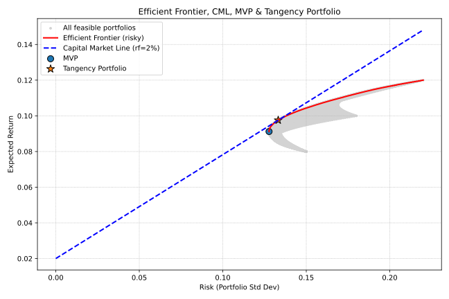

# מודל מרקוביץ { #markowitz_model }

**מודל מרקוביץ'** הוא אחד מאבני היסוד החשובות ביותר בתורת ההשקעות המודרנית (Modern Portfolio Theory – MPT). המודל פותח בשנת 1952 על ידי הכלכלן **הארי מרקוביץ'** אשר זכה על כך בפרס נובל לכלכלה בשנת 1990. המודל מבסס פתרון מתמטי לבניית תיקי השקעות אופטימליים תוך איזון בין **תשואה צפויה** לבין **סיכון** (המבוטא במונחי סטיית תקן) **בהתאם להעדפת המשקיע**. המודל מדגים כיצד ניתן להפחית סיכון באמצעות **פיזור** נכון.

לא מעט רואים במודל מרקוביץ' את אחד המודלים החשובים לניהול תיקי השקעות מכיוון שזו הייתה הפעם הראשונה בה הוצע מודל שבו הסיכון ניתן להגדרה פורמאלית ולמדידה אמפירית.

כפי שנראה בהמשך, מודל זה אינו חף ממגבלות. יחד עם זאת- שילוב העקרונות שנטבעו בו (סיכון, קורלציה, פיזור) מהווים בסיס לתאוריות ניהול תיקים מאוחרות יותר ואף ישמשו אותנו במודל ה AI שלנו.

---

## עקרונות המודל { #principals }

מודל מרקוביץ' מבוסס על מספר הנחות יסוד:

- **משקיעים פועלים רציונלית** – הם שואפים למקסם תשואה צפויה ולמזער סיכון.
- **הסיכון נמדד באמצעות סטיית תקן** – כלומר, תנודתיות התשואות.
- **התשואות מנורמלות** – מניחים כי התשואות מתפלגות נורמלית.
- **אין עלויות עסקה או מיסוי** (בגרסה הבסיסית של המודל).
- **תקופת השקעה חד- פעמית** – המודל עוסק בניתוח סטטי - cנקודת זמן אחת.

## הגדרה פורמאלית { #formal_definition }

### תשואה צפויה לתיק השקעות { #expected_return }

התשואה הצפויה לתיק היא ממוצע משוקלל של התשואות הצפויות של הנכסים:

$$
E(R_p) = \sum_{i=1}^{n} w_i \cdot E(R_i)
$$

כאשר:

- $E(R_p)$ – התשואה הצפויה לתיק.
- $w_i$ – המשקל של נכס $i$ בתיק (סכום המשקולות = 1).
- $E(R_i)$ – התשואה הצפויה של נכס $i$.

### סיכון התיק { #portfolio_risk }

בניגוד לחשיבה אינטואיטיבית, הסיכון הכולל של התיק **אינו רק ממוצע סטיות התקן** של הנכסים, אלא תלוי גם **במתאם** ביניהם:

$$
\sigma_p = \sqrt{\sum_{i=1}^{n} \sum_{j=1}^{n} w_i w_j \cdot \text{Cov}(R_i, R_j)}
$$

כאשר:

- $\sigma_p$ – סטיית התקן של התיק.
- $\text{Cov}(R_i, R_j)$ – השונות המשותפת (Covariance) בין נכס $i$ לנכס $j$.

במקרה של שני נכסים בלבד:

$$
\sigma_p = \sqrt{w_1^2\sigma_1^2 + w_2^2\sigma_2^2 + 2w_1w_2 \rho_{12}\sigma_1\sigma_2}
$$

כאשר $\rho_{12}$ הוא מקדם המתאם בין שני הנכסים.

## הגבול היעיל { #efficient_frontier }

באמצעות חישוב כל שילובי הנכסים האפשריים (משקולות $w_i$), ניתן לשרטט את **עקום הגבול היעיל (Efficient Frontier)** :

- זהו קו המייצג את התיקים האופטימליים שנותנים **תשואה מקסימלית לכל רמת סיכון נתונה** או **סיכון מינימלי לכל רמת תשואה נתונה**.
- תיקים מתחת לקו זה נחשבים **לא יעילים**, ותיקים מעל הקו אינם אפשריים (מבחינה מתמטית).

## השפעת הפיזור { #diversification_effect }

אחת המסקנות המרכזיות של מרקוביץ' היא כי שילוב של נכסים שאינם מושלמים בקורלציה (כלומר $\rho < 1$) מפחית את הסיכון הכולל של התיק **ללא פגיעה בתשואה הצפויה**.

- אם הקורלציה בין הנכסים נמוכה (או שלילית), ניתן להשיג **פיזור יעיל** שמקטין תנודתיות.
- אם הקורלציה גבוהה (קרובה ל- 1), הפיזור כמעט ואינו תורם להפחתת הסיכון.

## שילוב עם נכס חסר סיכון { #cml_line }

בהמשך פותח הרעיון לשילוב **נכס חסר סיכון** (כמו אג"ח ממשלתית קצרה) בשילוב תיק השוק היעיל:

- קו זה נקרא "קו השוק" **Capital Market Line (CML)**.
- כל משקיע בוחר נקודה על הקו לפי העדפותיו בין סיכון לתשואה:
  - משקיע סולידי – קרוב יותר לנכס חסר סיכון.
  - משקיע אגרסיבי – ייעזר במינוף כדי לעבור את תיק השוק.

## יתרונות וחסרונות המודל { #pros_cons}

### יתרונות { #pros }

- מסגרת מתמטית ברורה לבניית תיקי השקעות.
- מדגיש את חשיבות הפיזור והמתאם בין הנכסים.
- מהווה בסיס לפיתוחים כמו CAPM, VaR ורבים אחרים.

### חסרונות { #cons }

- הנחות לא ריאליות (התפלגות נורמלית, רציונליות מוחלטת).
- קשה לאמוד במדויק את הקורלציות והתשואות העתידיות.
- אינו מתחשב באסימטריה או "זנבות שמנים" בשווקים אמיתיים.
- המודל סובל מרגישות רבה לקורלציה

נקודה חשובה שאליה אנו חייבים לשים לב :

מודל מרקוביץ הוא הוא מודל **נורמטיבי** בכך שהוא **מניח** כי אלו הפרמטרים לפיהם אדם רציונלי צריך לבחור את תיק ההשקעה שלו. המודל **מניח** שהפרמטרים העומדים בתשתית בחירת ההשקעה של האדם הרציונלי הם: תוחלת הרווח וסטיית תקן ובנוסף - שיקולי הבחירה שלו הם- שהוא שונא סיכון. בעוד אלו הנחות סבירות למדי - המודל איננו קובע מה צריך להיות קשר הגומלין בין פרמטרים אלו.

## דוגמאות { #examples }

### דוגמה א: השפעת הפיזור { #example_1 }

נניח שני נכסים:

- נכס A: תשואה צפויה 8%, סטיית תקן 10%.
- נכס B: תשואה צפויה 12%, סטיית תקן 20%.
- מתאם ביניהם: $\rho = 0.2$.

אם נשקיע 50% בכל נכס:

$$
E(R_p) = 0.5 \cdot 8\% + 0.5 \cdot 12\% = 10\%
$$

$$
\begin{aligned}
E(R_p) &= 0.5 \cdot 8\% + 0.5 \cdot 12\% = 10\% \\[1em]
\sigma_p &= (0.5^2 \cdot 10^2) + (0.5^2 \cdot 20^2) + 2 \cdot 0.5 \cdot 0.5 \cdot 0.2 \cdot 10 \cdot 2 \\
&= 25 + 100 + 20 \\
&= 145 \approx 12.04\%
\end{aligned}
$$

בזכות הפיזור, סטיית התקן של התיק ירדה ל- 12.04%, נמוכה מממוצע הפשוט שלהן (15%)

### דוגמה ב: שילוב נתוני תשואה וקורלציה { #example_2 }

תיק השקעה כולל שלוש מניות: א', ב' ו - ג'. להלן נתונים נדרשים:

#### נתוני המניות

| מניה   | תשואה צפויה \(E(R_i)\) | סטיית תקן \(\sigma_i\) |
| ------ | ---------------------: | ---------------------: |
| **א׳** |                     8% |                    15% |
| **ב׳** |                    10% |                    18% |
| **ג׳** |                    12% |                    22% |

#### מטריצת קורלציית תשואות בין המניות

| מניה   |   א׳ |   ב׳ |   ג׳ |
| ------ | ---: | ---: | ---: |
| **א׳** | 1.00 | 0.30 | 0.20 |
| **ב׳** | 0.30 | 1.00 | 0.50 |
| **ג׳** | 0.20 | 0.50 | 1.00 |

#### משקל המניות בתיק

\[
w_A=40\%,\quad w_B=30\%,\quad w_C=30\%
\]

#### חישוב תשואת התיק הצפויה $E(R_p)$

תשואת התיק הצפויה היא ממוצע משוקלל של התשואות הצפויות של כל המניות בתיק.

$$
\begin{aligned}
E(R_p)&=\sum_{i=1}^{3} w_i\,E(R_i) \\[1em]
      &= (w_A \times E(R_A)) + (w_B \times E(R_B)) + (w_C \times E(R_C)) \\[1em]
      &= 0.4\cdot 8\% + 0.3\cdot 10\% + 0.3\cdot 12\% \\[1em]
      &= {9.8\%}
\end{aligned}
$$

#### חישוב השונות $\sigma_p^2$ וסטיית התקן $\sigma_p$ של התיק

סטיית התקן מודדת את הסיכון (תנודתיות) של התיק. </br>
החישוב לוקח בחשבון הן את **הסיכון** של כל נכס והן את **המתאם** (קורלציה) בין הנכסים.

**הנוסחה המלאה לשונות התיק:**

$$
\begin{aligned}
\sigma_p^{2} &= {w}^\top\,\Sigma\, {w} \\[1em]
         &= w_A^2\sigma_A^2 + w_B^2\sigma_B^2 + w_C^2\sigma_C^2 +
          2w_Aw_B\sigma_A\sigma_B\rho_{AB} + 2w_Aw_C\sigma_A\sigma_C\rho_{AC} + 2w_Bw_C\sigma_B\sigma_C\rho_{BC}
\end{aligned}
$$

**השונות של כל מניה (משוקללת):**

\(w_A^2\sigma_A^2 = 0.40^2 \times 0.15^2 = 0.16 \times 0.0225 = 0.0036\)

\(w_B^2\sigma_B^2 = 0.30^2 \times 0.18^2 = 0.09 \times 0.0324 = 0.002916\)

\(w_C^2\sigma_C^2 = 0.30^2 \times 0.22^2 = 0.09 \times 0.0484 = 0.004356\)

**השונות המשותפת (Covariance) בין כל זוג מניות:**

\(2w*Aw_B\sigma_A\sigma_B\rho*{AB} = 2 \times 0.40 \times 0.30 \times 0.15 \times 0.18 \times 0.30 = 0.00243\)

\(2w*Aw_C\sigma_A\sigma_C\rho*{AC} = 2 \times 0.40 \times 0.30 \times 0.15 \times 0.22 \times 0.20 = 0.001584\)

\(2w*Bw_C\sigma_B\sigma_C\rho*{BC} = 2 \times 0.30 \times 0.30 \times 0.18 \times 0.22 \times 0.50 = 0.003564\)

**חיבור כל הרכיבים לשונות התיק:**

$$
\sigma_p^2 = 0.0036 + 0.002916 + 0.004356 + 0.00243 + 0.001584 + 0.003564 = 0.01845
$$

**חישוב סטיית התקן (שורש השונות):**

$$
\sigma_p = \sqrt{0.01845} \approx 0.1358
$$

- **תשואת התיק הצפויה:** **9.8%**
- **סטיית התקן של התיק:** **13.58%**

התוצאה מדגימה את **עקרון הגיוון (diversification)**.
ממוצע משוקלל של סטיות התקן היה נותן סיכון של 18%, אך בזכות הקורלציה שאינה מושלמת בין המניות, הסיכון בפועל של התיק **נמוך יותר** באופן משמעותי.

#### חישוב החזית היעילה

עד כה, חישבנו את את הסיכון בתיק ואת התשואה הצפויה בהתאם למשקל המניות - שהיה נתון לנו. </br>
אי אפשר להראות את **החזית היעילה** של תיק המניות שלנו מחישוב משקולות של תיק בודד (כמו זה שחישבנו עם משקלות 40/30/30). החזית היעילה המחושבת צריכה להציג עבורנו את כל התיקים האופטימליים שניתן להרכיב מסל המניות בתיק.

החזית היעילה היא **עקומה גרפית** המייצגת את כל התיקים ה**אופטימליים** שניתן להרכיב מהמניות בתיק ההשקעה. כל נקודה על העקומה הגרפית מציגה את **התשואה הגבוהה ביותר לרמת סיכון נתונה.**

#### איך בונים את החזית היעילה?

בניית הגרף נעשה באמצעות אופטימיזציה ממוחשבת במצודה הבאה:

1. **בניית צירופי משקלות ניירות בתיק:** השלב הראשון הוא לתת למחשב לבנות אלפי צירופי משקלות שונים עבור המניות א', ב' ו-ג'.

     - לדוגמה: (100%, 0%, 0%), (99%, 1%, 0%), (50%, 25%, 25%), (33.3%, 33.3%, 33.3%) וכו'. התנאי היחיד הוא שסך כל המשקלות יהיה תמיד 100%. (אגב, בהנתן היכולת למכור בחסר- ניתן גם להתעלם ממגבלה זו)

2. **חישוב תשואה וסיכון לכל תיק:** עבור **כל אחד** מאלפי הצירופים שנבחרו בשלב הראשון יש לחשב את הפרמטרים שחישבנו בחלק הקודם: שלמדנו:
     - חישוב **תשואה צפויה** (\(E(R_p​)\))
     - חישוב **סטיית תקן** (\(σ_p\)​)

3. **מיפוי התיקים על גרף:** יוצרים גרף פיזור (Scatter Plot) שבו:

    - **ציר X** הוא הסיכון (סטיית תקן, \(σ_p\)).
    - **ציר Y** הוא התשואה הצפויה (\(E(R_p​)\)).
    - כל נקודה בגרף מייצגת תיק אחד עם הרכב משקלות ספציפי.

4. **זיהוי החזית היעילה:** לאחר שכל הנקודות ממופות, "ענן" של נקודות יתקבל בגרף. **החזית היעילה היא המעטפת העליונה-שמאלית של אותו ענן נקודות**. זוהי העקומה שמחברת את כל התיקים שאין טובים מהם.

5. **זיהוי נקודות עניין מיוחדות על החזית היעילה:** על העקומה עצמה יש כמה תיקים בעלי חשיבות מיוחדת:

    - **תיק מינימום שונות (MVP - Minimum Variance Portfolio):** זוהי הנקודה **השמאלית ביותר** על העקומה. זהו התיק בעל **הסיכון הנמוך ביותר** מכל התיקים האפשריים שניתן להרכיב מהמניות.

    - **התיק המשיק (Tangency Portfolio):** זהו התיק ה"כוכב" של החזית היעילה. זהו התיק שמציע את יחס התגמול-לסיכון הטוב ביותר, הנמדד על ידי **יחס שארפ (Sharpe Ratio)**. באופן גרפי, זהו התיק שבו קו ישר (CML) היוצא מנקודת "נכס חסר סיכון" (למשל, מק"מ) משיק לחזית היעילה. רוב מנהלי ההשקעות שואפים להחזיק בתיק זה ולשלב אותו עם הנכס חסר הסיכון.
 
להלן הדגמה של חישוב החזית היעילה עם גרף "Efficient Frontier" בסימולציה ב-Python

=== "מודל מרקוביץ- פלט"
    
    בגרף המתואר :
      
      - **הענן האפור** מדגים את תוצאות צירופי כל המשקלים של המניות בתיק.
  
      - **הקו האדום** - "החזית היעילה" עקומה שמחברת את כל התיקים שאין טובים מהם. רק הצירופים מהנקודה הכחולה ומעלה על גבי הקו האדום - מהווים את החזית היעילה שבתיק. 
      
      - **הקו המקווקו הכחול**: "קו השוק" **(CML)**. שילוב של נכס חסר סיכון בתיק 
      
      - **הנקודה הכחולה**:  זהו התיק בעל **הסיכון הנמוך ביותר** מכל התיקים האפשריים שניתן להרכיב מהמניות (תיק MVP).
      
      - **הכוכב**: זהו התיק שמציע את יחס התגמול-לסיכון הטוב ביותר (Tangency Portfolio)
 
=== "Python" 
    ```python
        import numpy as np
        import matplotlib.pyplot as plt
        # === Inputs ===
        # Expected returns and volatilities (standard deviations)
        returns = np.array([0.08, 0.10, 0.12])
        std_devs = np.array([0.15, 0.18, 0.22])
        # Correlation matrix between the assets
        corr_matrix = np.array([[1.00, 0.30, 0.20], [0.30, 1.00, 0.50], [0.20, 0.50, 1.00]])
        # Risk-free rate (for CML and tangency portfolio)
        rf = 0.02  # 2%
        # === Covariance matrix ===
        # Cov = D_sigma * Corr * D_sigma, here via outer product
        cov_matrix = np.outer(std_devs, std_devs) * corr_matrix
        # === Generate long-only weight combinations (w1 + w2 + w3 = 1) ===
        weights_list = []
        port_returns = []
        port_risks = []
        for w1 in np.linspace(0, 1, 100):
            for w2 in np.linspace(0, 1 - w1, 100):
                w3 = 1 - w1 - w2
                weights = np.array([w1, w2, w3])
                # Portfolio return and standard deviation
                p_ret = np.dot(weights, returns)
                p_var = np.dot(weights.T, np.dot(cov_matrix, weights))
                p_std = np.sqrt(p_var)
                weights_list.append(weights)
                port_returns.append(p_ret)
                port_risks.append(p_std)
        weights = np.array(weights_list)
        port_returns = np.array(port_returns)
        port_risks = np.array(port_risks)
        # === Efficient frontier (upper envelope by return for each risk) ===
        # Sort by risk and keep points that improve max return seen so far
        order = np.argsort(port_risks)
        eff_risks, eff_returns = [], []
        max_ret_so_far = -np.inf
        for idx in order:
            if port_returns[idx] > max_ret_so_far:
                max_ret_so_far = port_returns[idx]
                eff_risks.append(port_risks[idx])
                eff_returns.append(port_returns[idx])
        eff_risks = np.array(eff_risks)
        eff_returns = np.array(eff_returns)
        # === Minimum-Variance Portfolio (MVP) ===
        idx_mvp = np.argmin(port_risks)
        risk_mvp = port_risks[idx_mvp]
        ret_mvp = port_returns[idx_mvp]
        w_mvp = weights[idx_mvp]
        # === Tangency Portfolio (max Sharpe ratio vs. rf) ===
        # Avoid division by zero in Sharpe
        eps = 1e-12
        sharpes = (port_returns - rf) / np.maximum(port_risks, eps)
        idx_tan = np.argmax(sharpes)
        risk_tan = port_risks[idx_tan]
        ret_tan = port_returns[idx_tan]
        w_tan = weights[idx_tan]
        # === Capital Market Line (CML) ===
        # Line from (0, rf) to the tangency portfolio
        slope = (ret_tan - rf) / risk_tan
        risk_line = np.linspace(0.0, port_risks.max(), 200)
        ret_line = rf + slope * risk_line
        # === Plot ===
        plt.figure(figsize=(9, 6))
        # All feasible portfolios
        plt.scatter(
            port_risks, port_returns, s=8, c="lightgray", label="All feasible portfolios"
        )
        # Efficient frontier (risky assets only)
        plt.plot(eff_risks, eff_returns, "r-", linewidth=2, label="Efficient Frontier (risky)")
        # Capital Market Line
        plt.plot(risk_line, ret_line, "b--", linewidth=2, label="Capital Market Line (rf=2%)")
        # Mark MVP and Tangency points
        plt.scatter([risk_mvp], [ret_mvp], marker="o", s=80, edgecolors="k", label="MVP")
        plt.scatter(
            [risk_tan], [ret_tan], marker="*", s=140, edgecolors="k", label="Tangency Portfolio"
        )
        # Labels and aesthetics
        plt.xlabel("Risk (Portfolio Std Dev)")
        plt.ylabel("Expected Return")
        plt.title("Efficient Frontier, CML, MVP & Tangency Portfolio")
        plt.legend()
        plt.grid(True, linestyle=":")
        plt.tight_layout()
        plt.show()
    ```
 